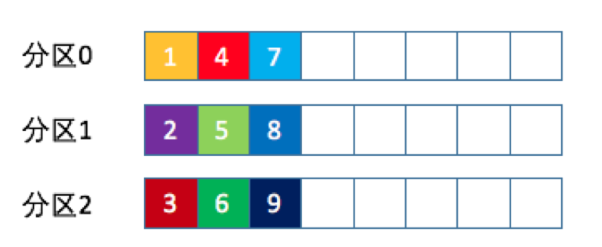

# kafka

专业术语

主题（Topic）：发布订阅的对象，可以为每个业务，每个应用，每类数据都创建专属的主题

生产者（Producer）：向主题发布消息的客户端（Clients）应用程序

消费者（Consumer）：订阅这些主题消息的客户端（Clients）应用程序

Broker：Kafka 的服务器端由被称为 Broker 的服务进程构成，不同的Broker 进程分数运行在不同的机器上（高可用保证）
<!--more-->
备份机制（Replication）: 把相同的数据拷贝到多台机器上，而这些相同的数据拷贝称为副本（Replica）

领导者副本（Leader Replica）: 外提供服务，对外指的是与客户端程序进行交互

追随者副本（Follower Replica）：不能与外界交互

副本的工作机制也很简单：生产者总是向领导者副本写消息；而消费者总是从领导者副本读
消息。至于追随者副本，它只做一件事：向领导者副本发送请求，请求领导者把最新生产的
消息发给它，这样它能保持与领导者的同步。

伸缩性（Scalability）：把数据分割成多份保存在不同的Broker上

这种机制就是所谓的分区（Partitioning）

# 分区

分区是提供负载均衡能力，保证了系统的高伸缩性

## 分区策略

### 自定义分区策略

在编写生产者程序时，实现 `org.apache.kafka.clients.producer.Partitioner` 接口

实现 partition() 方法

```java
partition(String topic,  Object key,  byte[] keyBytes, 
          Object value,  byte[] valueBytes,  Cluster cluster);
```

*//设置自定义分区*

`kafkaProps.put("partitioner.class", "com.chb.partitioner.MyPartitioner");`

### 轮询策略

按照顺序分配

轮询策略有非常优秀的负载均衡表现，它总是能保证消息最大限度地被平均分配到所有分区上，故默认情况下它是最合理的分区策略，也是我们最常用的分区策略之一。



### 随机策略

随机就是我们随意地将消息放置到任意一个分区上

先计算出该主题总的分区数，然后随机地返回一个小于它的正整数

### 按消息键保序策略

kafka 允许每条消息自定义 key 并且可以把相同的key 推送到相同的分区

使用场景：根据地理位置分区

# 生产者压缩算法

压缩：以时间换空间

Kafka 中的消息格式为 消息集合(message set) 消息{message}

一个集合包含若干项日志想，日志才是真正封装消息的地方

V1版本：

- 每条消息都需要做CRC校验
- 多条消息单独压缩，

V2版本：

- 将消息的公共部分抽取出来，放到外层消息集合里面，CRC校验工作被移到了消息集合这一层
- 消息压缩方法改进：对消息集合进行压缩

## 何时压缩

- 生产者端
- Broker 端

生产者 commpression.type 参数 标识启动指定类型的压缩算法

```java
Properties props = new Properties();
props.put("compression.type", "gzip");

Producer<String, String> producer = new KafkaProducer<>(props);
```

Broker 端进行压缩情况

- Broker 指定了和 Producer 端不同的压缩算法
- Broker 端发生了消息格式的转换

## 何时解压缩

Consumer 端自行解压缩

> Producer 端压缩，Broker 端保持，Consumer 端解压缩

- 压缩算法

- GZIP

- Snappy

- LZ4 （吞吐量大）

- Zstandard (zstd) 2.1.0后支持  （压缩比高）

何时使用：

- CPU资源充足
- 带宽资源不足

# 无消息丢失配置

Kafka 只对 已提交 的消息 做有限度的持久化保证

- 已提交

    如何定义已提交的数据，Kafka 回复 数据已提交，才是已提交

    具体有多少 Broker 个已提交,看业务定义

- 有限度的持久化保证

    N个Broker 中至少有1个还存活，那么Kafka 就能保证数据不会丢失

## 数据丢失案例

- 生产者程序丢失数据

生产者在推送给 Broker 中 不关心是否成功，那么当未成功时，数据丢失

解决方案：使用带有回调通知的发送API `producer.send(msg, callbask)`

- 消费者丢失数据

消费者，先位移后消费，消费时，消费者挂了，应该先位移后消费

- 多线程消费

当多线程消费，应该手动进行提交位移

## 最佳实践

- 使用带有回调函数的发送消息`producer.send(msg, callbask)`
- 设置 acks = all ，ask 是Producer 的一个参数，代表了对已提交的定义，设置成all 表示所有的副本都收到消息，裁断已提交。
- 设置retries 为较大的值，Producer 能够自动重试，避免消息丢失
- 设置 unclean.leader.election.enable = false 不允许一个落后 Leader 太多的 Broker 成为 leader
- 设置 replication.factor = 3 , Broker 参数， 最好将消息多保存几份，避免丢失，毕竟防止消息丢失的主要机制就是冗余
- 设置min.insync.replicas > 1 Broker 参数，控制消息至少要被写入多少份，才算已提交
- 推荐 replication.factor = min.insync.replicas + 1 如果两者相等，那么只要有副本挂了，整个分区就无法正常工作了
- 确保消息消费完再提交，Consumer 端的 enable.auto.commit 设置成 false ,并采取手动提交位移的方式。

# 生产者是如何管理TCP连接的、

## 创建连接

- 生产者在创建producer 对象的时候，就会创建一个TCP连接 发送 METADATA 请求，尝试获取集群的元信息
- 生产者在更改元数据的时候，也会创建TCP连接
- 生产者在发送消息时

## 关闭连接

- 用户主动关闭 `producer.close()`
- KAafka 自动关闭 超过9分钟没动静，就会被关闭 [connections.max.idle.ms](http://connections.max.idle.ms) = -1 可以关闭这个配置

# 消费者是如何管理TCP连接的

## 创建连接

- 构建KafkaConsumer 实例是不创建TCP连接
- 发起 findCoordinator 请求时 - 希望消费者集群告诉自己 哪个Broker 是 协调者 向负载最小的那台 Broker 询问。
- 连接 协调者时
- 消费数据时

创建3类连接

- 确定协调者和获取集群元数据
- 连接协调者，令其执行组成员管理操作
- 执行时间的消息获取

## 关闭连接

- 当第三类连接创建成后，消费者会主动关闭第一类TCP 连接
- 主动关闭 kafkaConsumer.close()
- 自动关闭 消费者 端  [connections.max.idle.ms](http://connections.max.idle.ms) = -1

# 消费者组

Consumer Group 是kafka 提供的 可扩展且 有容错性的 消费者机制

每个组内有多个消费者实例，共享一个消费者组 ID，共同消费 主题下的全部分区

每个分区只能由同一个组内的一个 消费者实例来消费

> Kafka 使用了消费者组这一种机制，同时实现了传统消息引擎系统的两大模型
点对点（消息队列）
发布订阅
同一个组内属于 - 点对点
不同组 属于 - 发布订阅

理想情况下 消费者组内的数量 应该等于 订阅主题的分区总数

## 消费者组位移

- 老版本 的消费位移 存放在 zookeeper 中

    > Zookeeper 是一个分布式的协调服务框架， Kafka  重度依赖  实现各种各项的协调管理
    减少 broker 端的状态保存开销。
    zookeeoer 不适合平常的操作，大量的写操作 会拖慢 zookeeper 集群的性能

- 新版本 保存为kafka Broker 内部主题  *consumer_offsets*

# 消费者 重平衡（Rebalance）

Rebalabce 本质上是一种协议，规定了消费者组内所有的消费者达成一致，分配订阅主题的分区

## 合适发生重平衡

- 组成员数发生变更
- 订阅主题数发生变更
- 订阅主题数的分区发生变更

## 分配策略

社区会不断完善保证最公平的分配策略

## 重平衡缺点

- 重平衡过程中，所有消费者实例都会停止消费，直到重平衡完成
- 目前重平衡的时间是，所有消费者实例 共同参与 全部重新分配所有分区

    最好是 原本消费者实例 消费的分区最好不变

- 重平衡很慢

# 内部主题 Tnternal Topic 


*consumer_off*sets - 位移主题