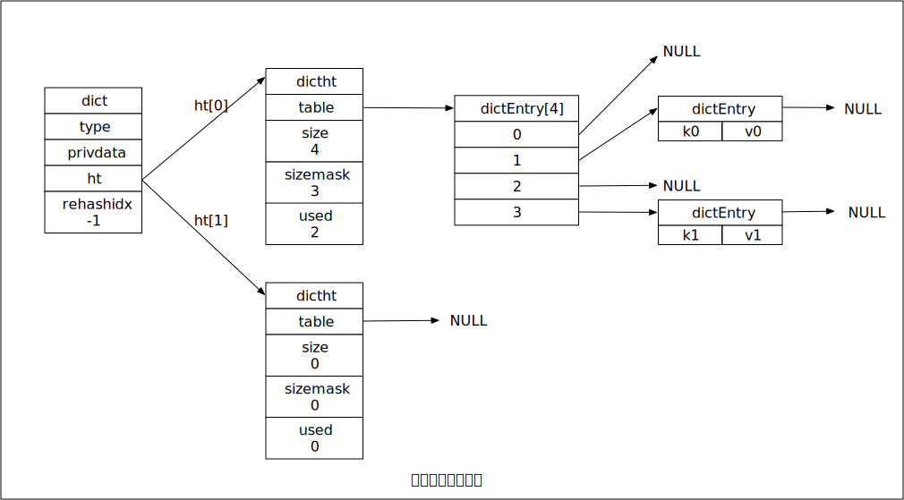
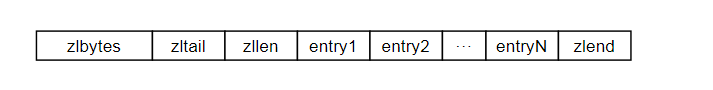
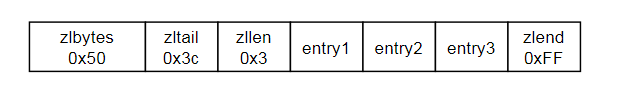

# 简单动态字符串

区别于C语言传统的字符串表示：

- C语言使用长度为N+1的字符数组来表示长度为N的字符串。
- redis实现了简单动态字符串(Simple Dynamic String, SDS), 并作为redis 的默认字符串表示。
  - redis 中C字符串只会作为字符串字面量，用在无需修改字符串值的地方，比如记录日志
  - Redis 需要一个可以被修改字符串值时，使用SDS,

> `redis > SET msg "Hello world"`
> reids 将在数据库创建一个新的键值对，其中：
>  — 键值对的键是一个字符串对象，对象的底层实现是一个保存着字符串“msg”的SDS
>  — 键值对的值时一个字符串对象，对象的底层实现是一个保存着字符串“Hello world”的SDS


## SDS的定义

### 数据结构

```c
struct sdshdr{
	// 记录 buf 数组中已使用字节的数量
	// 等于 SDS 所保存字符串的长度
	int len;
	// 记录 buf 数组中未使用字节的数量
	int free;
	// 字节数组，用于保存字符串
	char buf[];
}
```


- free 属性值为0，表示这个SDS没有分配未使用空间
- len 属性值为5，表示这个SDS保存了一个五字节长的字符串
- buf 属性是一个char类型的数组，前五个字节保存 R e d i s, 最后一个字节保存 ‘\0’

SDS尊循C字符串

> SDS 的 buf 数组的实际长度是 `STRLEN = len + free + 1 (byte)`

## SDS 与 C字符串的区别

1、常数复杂度获取字符串长度

SDS数据结构中 `len` 属性积累了 `buf` 的长度，将获取字符串长度所需的时间复杂度从 `O(n)` 降低到了`O(1)`级别，

这确保了获取字符串长度这样的工作不会成为Redis的性能瓶颈。

2、杜绝缓冲区溢出(buffer overflow)

比如该函数`char *strcat (char *dest, coust char *src);` 用于将`src`拼接到`dest`字符串后面，

- C字符串在修改字符串值时，忘记给`dest`申请足够的内存，容易发生缓冲区溢出。若存在相邻的两个字符串，则容易覆盖后一个字符串的值。
- SDS的内存分配策略杜绝了发生缓冲区溢出的可能性：当SDS API需要对字符串修改，API会先检查SDS的内存空间是否满足修改所需的要求，如果不满足，API 会自动扩展SDS的内存后执行字符串修改

3、减少修改字符串时带来的内存重分配次数

- C字符串内存分配策略：每次对字符串修改，都要由程序进行一次内存的重新分配

  - 若增加字符串长度，则需要申请内存，扩展字符数组的大小，否则会产生缓冲去溢出
  - 若缩短字符串长度，则需要释放不需要的那部分内存，否则会产生内存泄漏

- SDS内存分配策略

  - 空间预分配策略：用于优化SDS字符串增长操作，API 内部实现，无需程序另外操作，在对SDS需要空间扩展时，会分配给SDS所需的内存大小和额外的内存大小

    分配大小规则：

    - 如果对SDS进行修改后，SDS的长度（`len`的属性值）小于1MB，那么程序将分配和`len`属性相同大小的未使用空间(free)，这时 `len = free`
    - 如果对SDS进行修改后，SDS的长度（`len`的属性值）大于1MB，那么程序将分配1MB大小的未使用空间(free)，这时 `free = 1MB`

  - 惰性空间释放：当SDS的 API 需要缩短字符串时，并不重新进行内存释放，而是使用free属性将这些字节的数量记录起来，留待后面使用。

4、二进制安全

- C字符串：字符必须使用某种编码保存，并且不能含有空字符，而且只能保存文本，不能保存图片这样的二进制数据。
- SDS： API 都会以处理二进制的方式处理SDS存放在buf中的数据（buf属性被称为字节数组）
  - Redis 不是用这个数组保存字符，而是用它来保存一系列二进制数据

5、兼容部分C字符串函数

redis 遵循C字符串以空字符结尾的惯例，就是为了重用C语音的字符串函数。

### 总结

C字符串和SDS之间的区别

| 区别     | C字符串                              | SDS                                  |
| -------- | ------------------------------------ | ------------------------------------ |
| 复杂度   | 获取字符串长度的复杂度为O(n)         | 获取字符串长度的复杂度为O(1)         |
| 安全性   | API是不安全的，会造成缓冲区溢出      | API是安全的，不会造成缓冲区溢出      |
| 内存分配 | 修改N次字符串，必然有N次内存重新分配 | 修改N次字符串，最多有N次内存重新分配 |
| 保存数据 | 只能保存文本数据                     | 可以保存文本数据和二进制数据         |
| 函数库   | 可以使用所有<string.h>库中的函数     | 可以使用部分<string.h>库中的函数     |

## SDS API

SDS 数据结构向上提供 API


# 链表

C语言中没有内置链表数据结构，故Redis构建了自己的链表实现

列表键的底层实现就是链表，发布与订阅，慢查询，监视器等功能也使用了链表

## 数据结构

```c
// adlist.h/list
// 链表数据结构
typedef struct list {
	// 表头结点
	listNode * head;
	// 表尾节点
	listNode * tail;
	// 链表包含的节点数量
	unsigned long len;
	// 节点值复制函数
	void *(*dup) (void *ptr);
	// 节点值释放函数
	void (*free) (void *ptr);
	// 节点值对比函数
	int (*mathc) (void *ptr, void *key);
} list
```

```c
// adlist.h/listNode
// 链表中的节点数据结构
typedef struct listNode {
	// 前置节点
	struct listNode * prev;

	// 后置节点
	struct listNode * next;

	// 节点的值
	void * value;
}listNode;
```


Redis 的链表实现的特征总结：

- 双端：链表节点带有 `prev` 和 `next` 指针，获取某个节点的前置和后置的时间复杂度都是O(1)
- 无环：表头结点的prev 指针和表尾节点next 指针，均指向 NULL, 对链表的访问以NULL 为结束
- 带表头和标王指针，程序获取表头节点或表尾节点的时间复杂度都为O(1)
- 带链表长度计数器，获取链表中节点数量的时间复杂度 O(1) 为 len 属性。
- 多态，链表节点使用void* 指针来保存节点值，并可以通过list结构的dup、free、match三个属性为节点值设置类型特定函数，所以链表可以用来保存各种不同类型的值

## 链表和链表节点的API


# 字典

字典，又称符号表（symbol table），关联数组（associative array）或映射（map），是一种保存键值对（key-value pair）的抽象数据结构

## 数据结构

```c
// dict.h/dict
// 字典表
typedef struct dict {
	dictType *type;      // 类型特定函数
	void *privdata;      // 私有数据
	dictht ht[2];        // 哈希表 两个，用于rehash
	// rehash 索引 当rehash 不在进行时，值为 -1
	int trehashidx;      /* rehashing not in progress if rehashidx == -1*/
} dict;

// 操作特定类型键值对的函数
typedef struct dictType {

	// 计算哈希值的函数
	unsigned int (*hashFunction) (const void *key);

	// 复制键的函数
	void *(*keyDup) (void *privdata, const void *key);

	// 复制值得函数
	void *(*valDup) (void *privdata, const void *obj);

	// 对比键的函数
	int (*keyCompare)(void *privdata, const void *key1, const void * key2);

	// 销毁键的函数
	void (*keyDestructor) (void *privdata, void *key);

	// 销毁值得函数
	void (*valDestructor) (void *privdata, vlid *obj);

} dictType;

```

```c
// dict.h/dictht
// 哈希表
typedef struct dictht {

	//哈希表数组 存放哈希表节点的数组，hash后的键值对存放位置
	dictEntry **table;
	// 哈希表大小
	unsigned long size;
	 // 哈希表大小掩码，用于计算索引值，总是等于size - 1
	unsigned long dizemask;
	// 该哈希表已有的节点数量 总的key-value数量
	unsigned long used;

}dictht;
```

```c
// dict.h/dictEntry
// 哈希表节点
typedef struct dictEntry {
	// 键
	void *key;
	// 值
	union {
		void *val;
		uint64_t u64;
		int64_t s64;
	}	v;
	// 指向下一个哈希表节点，形成链表
	struct dictEntry *next;

} dictEntry;
```



## 哈希算法

- Redis 计算哈希值和索引值的方法：

```c
# 使用字典设置的哈希函数，计算键key的哈希值
hash = dict->type->hashFucntion(key);

# 使用哈希表的 sizemask 属性和哈希值，计算出来索引值，
# 根据情况不同，ht[x] 可以是 ht[1] 或 ht[0]
index = hash & dict->ht[x].sizemask;
```

> 当字典被用着数据库底层实现，或者哈希键的底层实现时，Redis 使用 MurmurHash2 算法来计算键的哈希值，该算法在输入的键是有规律的情况下，也能给出一个很好的随机分布性，并且计算速度也很快。

## 解决键冲突

Redis 的哈希表使用链地址法（separate chaining）来解决键冲突，每个哈希表节点都有一个next 指针，多个哈希表可以使用next指针构成一个单项链表，被分配到同一个索引上的多个节点可以用这个单项链表连接起来，这就解决了键冲突问题。

## rehash

为了让哈希表的负载因子（load factor）维持在一个合理的范围之内，当哈希表的键值对数量太多或太少时，程序需要对哈希表的大小进行相应的扩展或收缩，通过执行rehash（重新散列）操作完成。

步骤如下：

1. 为字典的 ht[1] 哈希表分配空间，分配的空间大小取决于要执行的操作，以及ht[0]当前包含的键值对数量（ht[0].used的属性值）

   - 若为扩展操作，ht[1]的大小是 第一个大于等于`ht[0].used * 2`的2$^n$。
   - 若为收缩操作，ht[1]的大小是 第一个大于等于`ht[0].used`的2$^n$。

2. 将保存在ht[0]中的所有键值对rehash到 ht[1] 上，rehash 指的是在ht[1]上重新计算hash值和索引，并将键值对放置到ht[1]的对应位置上。

   > rehash 的动作不是一次性的，而是分多次渐进的完成

   - 在字典中维持一个索引计数器变量 rehashidx ，并将值设为 0 ，表示rehash 工作开始。
   - 每次在对字典执行操作时，程序除了指定操作外，还会将ht[0]哈希表在rehashidx 索引上的索引键值对rehash到 ht[1] 上，当rehash 工作完成后， rehashidx 的值 将 + 1；
   - 随着字典操作的不断执行，最终某个时间上，ht[0] 上的键值对 都会 rehash 到 ht[1] 上，rehashidx 的值会设置为 -1， 表示rehash 工作结束。

3. 释放ht[0] ,将 ht[1] 设置为 ht[0], 在ht[1] 创建新的哈希表，为下次rehash做准备。

## 哈希表的扩展与收缩

当一下条件中的任一个被满足时，程序将自动对哈希表执行扩展操作：

1. 服务器目前没有在执行 BGSAVE 或 BGREWRITEAOF 命令，并且哈希表的负载因子大于等于1。

2. 服务器目前正在执行 BGSAVE 或 BGREWRITEAOF 命令，并且哈希表的负载因子大于等于5。

   ```sql
   # 负载因子 = 哈希表已保存的节点数量 / 哈希表的大小
   load_factor = ht[0].used / ht[0].size
   ```

> 哈希表扩展操作需要的负载因子，为何会因子服务器执行BGSAVE 或 BGREWRITEAOF 命令 而不同？
> 因为 服务器执行`BGSAVE` , `BGREWRITEAOF` 命令的过程中，Redis 需要创建当前进程的子进程，而大多数操作系统都采用写是复制（copy-on-write）技术来优化子进程的使用效率，所以若有子进程，Redis 提高负载因子，从而避免子进程存在期间对哈希表进行扩展操作，这样会避免不必要的内存写入，最大限度的节约内存。

## 渐进式的rehash

rehash 的动作不是一次性的，而是分多次渐进的完成 ，具体步骤，参考 rehash 步骤的第二步

## 渐进式rehash 执行期间，哈希表的操作

- 查找类的操作 会现在 ht0 内操作，没找到 会继续在 ht1 内操作
- 新增类操作，会直接在ht1 内操作


# 跳跃表

- 跳跃表是一种有序的数据结构，它通过每个节点中维护多个指向其他节点的指针，从而达到快速访问节点的目的。
- 跳跃表本质上是一个链表
- 链表加多级索引的结构，就是跳表。
- 跳跃表支持平均 O(logN)、最坏O(N) 复杂度的节点查找，也可以顺序性操作处理批量的节点。

## 数据结构

```c
typedef struct zskiplistNode {
    // 成员对象
    robj *obj;
    // 分值
    double score;
    // 后退指针
    struct zskiplistNode *backward;
    // 层
    struct zskiplistLevel {
        // 前进指针
        struct zskiplistNode *forward;
        // 跨度
        unsigned int span;
    } level[];
} zskiplistNode;
```

```c
typedef struct zskiplist {

    // 表头节点和表尾节点
    struct zskiplistNode *header, *tail;

    // 表中节点的数量
    unsigned long length;

    // 表中层数最大的节点的层数
    int level;

} zskiplist;
```



> - 每个跳跃表节点的层高都是1 ~ 32 之间的随机数同一个跳跃表中，多个节点可以包含相同的分值

# 整数集合

当一个集合只包含整数值元素，并且这个集合的元素值数量不多时，Redis 就会是用整数集合作为集合键的底层实现

## 数据结构

```c
//  intset.h/intset
typedef struct intset {
	// 编码方式
	uint32_t encoding;
	// 集合包含的元素数量
	uint32_t length;
	// 报错元素的数组
	int8_t contents[];
}
```



- INTSET_ENC_INT16 : int16_t 类型的整数数组（-32764 ~ 32767） $2^{15}$

- INTSET_ENC_INT32 : int32_t 类型的整数数组 取值范围 $-2^{31}$ ~ $2^{31}$

- INTSET_ENC_INT64 : int64_t 类型的整数数组 取值范围 $-2^{63}$ ~ $2^{63}$

## 升级

每当需要将一个新元素添加到数组中，并且新元素比苏中现在所有的元素类型都要长时，整数集合需要先进行升级操作，才能放入新元素

升级步骤：

1. 根据新元素的类型，扩展整数集合底层数组的空间大小，并分配新元素空间
2. 从后向前，将数据类型转换成与新元素相同，并放入数组中正确的位置
3. 将新元素添加进数组

> 新元素要么最大，要么最小， 所以放到数组的最前面或者最后面。

## 升级的好处

1. 提升灵活性，随意添加 16,32,64 不同类型类型的值，整数集合会自动转换
2. 节约内存，当 只有16 的情况下，会尽量的节约内存

## 降级

整数集合不支持降级，一旦升级之后，数据的数据类型不会降级。

# 压缩列表

压缩列表是Redis为了节约内存而开发的，是有一系列特殊编码的联系内存块组成的顺序型（sequential）数据结构，一个压缩列表可以包含任意多个节点，每个节点可以保存一个字节数组或者一个整数。





### 压缩列表各个组成部分的详细说明

| 属性    | 类型     | 长度  | 用途                                                         |
| ------- | -------- | ----- | :----------------------------------------------------------- |
| zlbytes | uint32_t | 4字节 | 记录整个压缩列表占用的内存字节数：<br />在对压缩列表进行内存重分配，或者计算zlend的位置时使用 |
| zltail  | uint32_t | 4字节 | 记录压缩列表表尾节点记录压缩列表的起始是在有多少字节：<br />通过这个偏移量，程序无须变量整个列表就可以确定表尾节点的地址 |
| zllen   | uint16_t | 2字节 | 记录了压缩列表包含的节点数量：<br />当这个属性值小于UINT16_MAX(65535)时，这个属性值就是压缩列表包含节点的数量；<br />当这个值等于UINT16_MAX时，节点数量需要遍历真个列表才能得到 |
| entryX  | 列表节点 | 不定  | 压缩列表包含的各个节点，节点的长度由节点内的内容决定         |
| zleng   | uint8_t  | 1字节 | 特殊值0xFF（十进制255）用于标记压缩列表的尾端                |

## 压缩列表节点的构成


- previous_entry_length: 以字节为单位，记录了压缩列表中前一个节点的长度。

  - 如果前一个节点的长度小于254字节，那么previous_entry_length 属性的长度为1字节：前一个节点的长度就保存在这个字节里面。
  - 如果前一个节点的长度大于等于254字节，那么previous_entry_length 属性的长度为5字节：前一个字节被设置为0xFE(十进制254)，后面四个字节保存前一节点的长度。

  > 计算前一个节点内存位置：`p = c - current_entry.previous_entry_length`
  > 压缩列表的从表尾向表头遍历操作就是使用这一原理实现的

- encoding

  节点的encoding 属性记录了节点content 属性所保存的数据类型以及长度

  字节数组编码

  | 编码（encoding）                                  | 编码长度 | content属性保存的值                |
  | ------------------------------------------------- | -------- | ---------------------------------- |
  | 00bbbbbb                                          | 1字节    | 长度小于等于63字节的字节数组       |
  | 01bbbbbb   xxxxxxxx                               | 2字节    | 长度小于等于16383 字节的字节数组   |
  | 10_ _ _ _ _ _ aaaaaaaa bbbbbbbb cccccccc dddddddd | 5字节    | 长度小于等于 4294967395 的字节数组 |

  整数编码

  | 编码（encoding） | 编码长度 | content属性保存的值                                          |
  | ---------------- | -------- | ------------------------------------------------------------ |
  | 11000000         | 1字节    | int16_t类型的整数                                            |
  | 11010000         | 1字节    | int32_t类型的整数                                            |
  | 11100000         | 1字节    | int64_t类型的整数                                            |
  | 11110000         | 1字节    | 24位有符号数                                                 |
  | 11111110         | 1字节    | 8位有符号数                                                  |
  | 1111xxxx         | 1字节    | 使用这一编码的节点没有相应的content属性，<br />因为编码本身的xxxx四个位已经保存了一个介于0和12之间的值，<br />所以他无需content属性 |

  - content

    节点的content属性赋值保存节点的值，可以是一个字节数组或者整数，值的类型和长度由encoding属性决定

## 连锁更新

新的节点长度较大，导致后面的节点需要更新previous_entry_length的长度，进而影响更后面的长度，导致连锁反应。

- 压缩列表存在连续的，需要连续更新长度的操作，概率很低
- 个别的操作，不会影响整体的性能